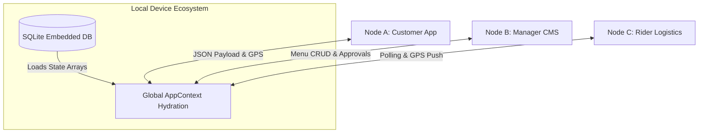
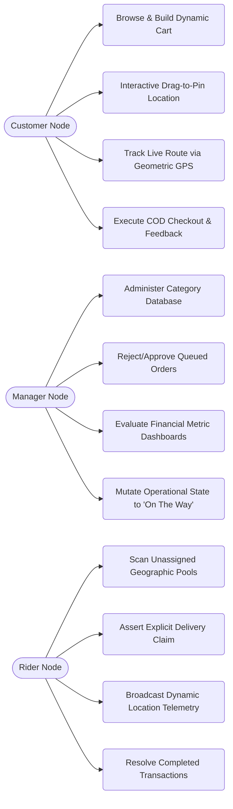
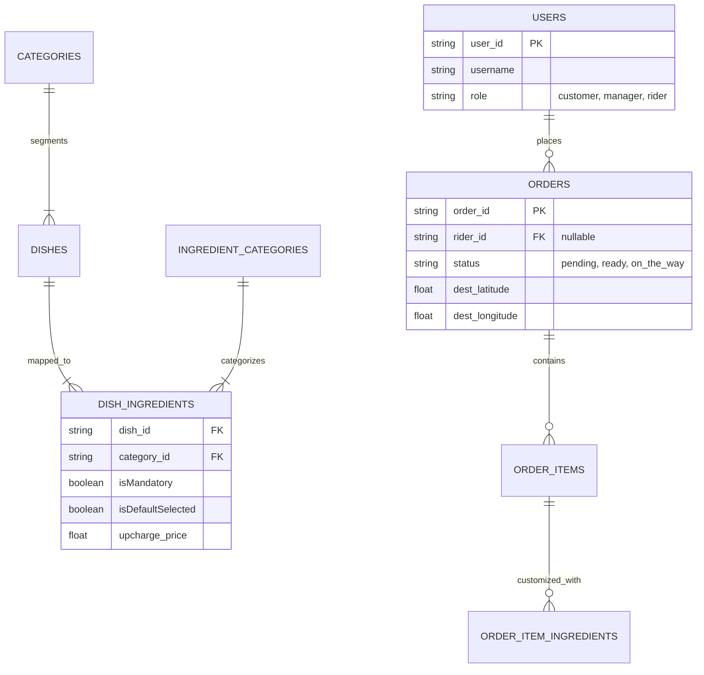
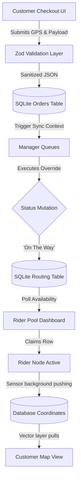

# Table of Contents

## Abstract
The Custom-Bite Suite is a comprehensive, meticulously engineered unified mobile ecosystem designed to completely overhaul and replace the dangerously fragmented state of modern restaurant operations. In today’s competitive hospitality industry, independent restaurants are forced to rely on a patchwork of disconnected third-party delivery aggregators (such as UberEats, DoorDash, and GrubHub), disjointed local Point-of-Sale (POS) systems, and completely independent third-party logistics tracking mechanisms. The Custom-Bite Suite solves this systemic inefficiency by centralizing the entire food service lifecycle—from customer menu browsing and intricate order customization to live kitchen command center processing and real-time geospatial delivery tracking—into one seamless, cohesive digital pipeline. 

By removing the reliance on massive, predatory third-party platforms, the Custom-Bite Suite gives total autonomy, direct-to-consumer relationships, and 100% of revenue back to the core restaurant. The platform goes far beyond generic cataloging by offering advanced enterprise-tier features: a hyper-granular menu customization engine that prevents costly culinary mistakes, real-time live GPS tracking mapped to interactive device components, and an integrated zero-developer Content Management System (CMS) that allows restaurant managers to add dishes, categorize ingredient matrices, and orchestrate live promotional banners directly from their handheld mobile devices without writing a single line of code.

## List of Figures
*(Figures and associated imagery are maintained externally and are structurally referenced throughout the software implementation and visual artifacts.)*

## Chapter: 1 | Introduction

- ### 1.1. Problem Specification/Statement 
Current restaurant operational models are fundamentally broken by an over-reliance on third-party aggregators. Independent restaurants typically utilize an isolated local Point-of-Sale (POS) system combined with multiple aggregator tablets sitting on the counter. This disjointed technological environment creates several catastrophic operational issues:
1. **Financial Exploitation**: Third-party platforms charge monumental operational commission fees (often ranging from 25% to 30% per order), operating at margins that strangle independent businesses.
2. **Poor Data Architecture and Customization**: Menu customization on existing aggregators is extremely limited. Customers often rely on unstructured, free-form text boxes ("No mayo, add pickles, extra toasted") to communicate complex dietary and culinary requests. This frequently leads to misinterpretation by the kitchen, unmet customer expectations, and wasted inventory.
3. **Loss of Arbitration Sovereignty**: Customer refunds and disputes are managed by remote third-party support centers prioritizing speed over truth. These platforms frequently issue automatic remote refunds to customers for disputed items without any investigation, deducting the amount directly from the restaurant's payout and leaving the physical restaurant powerless and financially liable for external courier errors.
The motivational trigger for this project is observing a localized independent diner suffer immense revenue leakage simply because they lacked a cohesive, proprietary digital platform capable of executing their operations directly to the consumer base without a middleman. 

- ### 1.2. Objectives 
- **Develop a standalone, premium mobile platform**: Build an Android-first, highly responsive, single-vendor food delivery application that acts as the exclusive digital storefront for the business.
- **Unify multi-actor experiences**: Seamlessly connect the Customer (demand), the Manager (execution/kitchen), and the Rider (logistics) into a single shared, highly synchronized state ecosystem.
- **Eliminate ordering ambiguity**: Implement a hyper-granular customization matrix that breaks down dish options strictly into 'Mandatory', 'Default', and 'Extra' properties, guaranteeing absolute accuracy in meal preparation and correct cost-charging for additional ingredients.
- **Integrate real-time geospatial tracking**: Provide live delivery tracking utilizing native GPS integration and the Haversine formula to render transparent, dynamically updating maps so customers can visually track their order's exact route in real time.
- **Democratize menu control**: Empower non-technical restaurant managers to manage complex menus live via a Zero-Developer Content Management System (CMS), bypassing the need to hire programmers or submit support tickets for seasonal menu changes.
    
- ### 1.3. Motivation and Scope 
The primary motivation for the Custom-Bite Suite is technical empowerment. We aim to grant independent restaurants the sophisticated operational efficiency and polished UI/UX traditionally exclusive to massive global franchises (like Domino's or McDonald's apps). The project scope strictly encompasses designing a local-first mobile application heavily leveraging React Native and Expo. The system must natively maintain high-fidelity user authentication, implement highly dynamic pricing algorithms reacting instantaneously to state changes, utilize structurally flawless relational database architecture running locally on the device via SQLite, provide uniquely mapped graphical user interfaces for three separate actor roles, and leverage complex geolocation map services for logistics orchestration. 
    
- ### 1.4. Organization Of Project Report 
- **Chapter 1: Introduction**: Articulates the core physical problems faced by the hospitality industry, the strict objectives of the software, and the foundational motivations guiding the development cycle.
- **Chapter 2: Background**: Undertakes a critical analysis of existing software systems in the market and reviews the mathematical and programming literature supporting the technological stack.
- **Chapter 3: System Analysis & Design**: Deeply details the chosen technologies, architectural methodologies, overarching system behavior, and comprehensive functional requirements.
- **Chapter 4: Implementation**: Deliberates upon the visual UI/UX design architecture, local state synchronization logic, and explicit module segmentation.
- **Chapter 5: User Manual**: Elaborates on both the minimum hardware parameters and provides structured guides on how actors interface with the software.
- **Chapter 6: Testing**: Enumerates the rigorous white-box and black-box verification strategies guaranteeing preventing data corruption within complex geospatial and financial domains.
- **Chapter 7: Conclusion**: Discusses holistic project outcomes, architectural limitations, and trajectories for future enterprise scalability.

## Chapter: 2 | Background

- ### 2.1. Existing System Analysis 
Existing aggregator systems like UberEats and DoorDash have successfully commercialized mass convenience. They offer immense market reach and beautifully constructed mobile interfaces. However, investigating their system mechanics reveals fatal flaws concerning vendor equity. These platforms act as digital landlords, extracting exorbitant percentages of the cart total as a service fee. In these ecosystems, the restaurant is merely a ghost kitchen; the platform owns the customer data, commands the logistics rules, and handles the financial mediation. 
Furthermore, existing secondary solutions (like white-labeled web wrappers that restaurants use to avoid aggregator fees) generally feature abysmally poor User Experiences. They are often clunky, non-native HTML wrappers that lack real mobile capabilities like native push notifications, smooth hardware map rendering, and 60fps animations.
The Custom-Bite Suite merges the best of both paradigms: it possesses the heavy-duty, ultra-premium graphical fidelity and hardware-level mapping integrations of an enterprise application while strictly acting as a first-party, single-vendor ecosystem where the business controls 100% of the customer relationship, keeps 100% of the revenue, and manages dispute resolutions firsthand via their own localized manager dashboard.
    
- ### 2.2. Supporting Literatures 
The technical foundations of this project are heavily reliant on modern cross-platform mobile engineering literature. We utilized React Native (Version 0.81.5) working synchronously with Expo SDK (Version 54.0.33) to allow one generalized JavaScript/TypeScript codebase to natively compile across mobile ecosystems. From a mathematical perspective, interpreting continuous GPS data packets for logistics relies on adopting the Haversine formula—a renowned trigonometric equation utilized to calculate the great-circle distance between two points on a sphere given their longitudes and latitudes. The data integrity methodology is supported by literature surrounding strict runtime validations as implemented by Zod, ensuring data payloads are rigorously sanitized before being inserted into the `expo-sqlite` embedded SQL database, maintaining a highly robust offset for potential local corruption.

## Chapter: 3 | System Analysis & Design

- ### 3.1. Technology & Tools
- **Framework & Engine**: React Native (`0.81.5`) initialized and bootstrapped through the Expo SDK (`54.0.33`). This ensures natively optimized rendering threads and immediate hardware coupling (Camera, GPS, Storage).
- **Core Language**: TypeScript. Implemented to guarantee strict compile-time type-safety over the massively complex relational models linking Customers to Disputed Orders to Ingredients.
- **Schema Validation**: `zod`. Utilized explicitly to sanitize payloads at runtime mapping and protecting raw database inputs against injection or malformed nested JSON errors.
- **State Management**: A React Context Provider (`AppContext.tsx`). An overarching architectural choice allowing a synchronized singular `AppSnapshot` to hydrate the entirety of the application tree, completely bypassing prop-drilling.
- **Storage Database**: `expo-sqlite`. Serving as the local persistence layer representing complex remote SQL architectures over locally stored relational tables.
- **Geospatial & Telematics Engine**: `@expo/location` and `react-native-maps`, processing high-frequency interval GPS pings and rendering MapView graphical vectors overlayed with directional Polylines.

- ### 3.2. Model & Diagram
        
    - #### 3.2.1. Model 
        The project adopted the **Agile Software Development Life Cycle (SDLC)**. Due to the high complexity of creating three effectively distinct applications (Customer app, Manager app, Rider app) combined into one suite, Agile was non-negotiable. Sprint iterations began with an early Minimal Viable Product restricted merely to relational schema generation and raw logic persistence. Consequential agile phases introduced the Customer Explore interface components, followed iteratively by Manager nodes, and conclusively binding the GPS logistics for the Rider Nodes. Each phase was thoroughly functionally tested before the next architectural branch was initiated.

    - #### 3.2.2. System Architecture
        The application is powered by what we mathematically designate as a "Tri-Node Centralized State System." 
        Rather than utilizing external API calls to a REST service, the architecture is a self-contained ecosystem powered by the internal Context hook payload `AppSnapshot`. 



        1. **Node A: Demand Generation (Customer)**: Engages with heavily optimized visual caching (the menu UI). Interacts with forms transforming selections into rigidly structured JSON representations stored within the centralized DB state.
        2. **Node B: Command Execution (Manager)**: A listening component actively rerendering on the detection of `pending` order state flags inserted by Node A. Exists concurrently as a CMS capable of fundamentally altering the foundational table schemas representing Dishes and Categorical items.
        3. **Node C: Delivery Logistics (Rider)**: A polling node filtering only orders specifically explicitly marked `on_the_way` by Node B. Serves fundamentally to read assignment payload metadata and write persistent sensory GPS coordinates back to the global state tree.

    - #### 3.2.3. Use Case Diagram
        An extensive abstraction of active capabilities:



        - **The Customer** holds use cases to: Search Menu (Filter via Category), Build Dynamic Cart Configurations (Add extra cheese, remove standard pickles), Invoke Geographic Drag-to-Pin targeting via an interactive map surface, complete Cash-On-Delivery checkout, visually observe their assigned courier moving on a map array, and submit localized feedback or refund queries directly to management.
        - **The Manager** handles extremely dense administrative use cases: Manipulate Menu Database Entities (Upload imagery, specify Mandatory elements vs Optional Add-ons, re-price items instantly), Interface directly with a Live Logistics Dashboard (Actively accepting or rejecting customer inputs), arbitrate refund conflicts, and review aggregated financial statistics of closed sales across generalized timeframes.
        - **The Rider** is equipped purely for logistics execution: Scan a dashboard for unassigned local delivery tasks, claim ownership of specific Orders, expand delivery directions incorporating Google Maps linking, log customer contact execution, collect COD cash payments, and mark final delivery successes.
        
    - #### 3.2.4. Class Diagram/ER Diagram
        The architectural Entity-Relationship structure features deeply hierarchical linkages:



        - The absolute root entity is `users`, distinctly segregated by rigid string types ('customer', 'manager', 'rider').
        - The `categories` and respective `dishes` share a one-to-many bind. 
        - Dishes associate inextricably with `ingredient_categories` to generate `dish_ingredients` matrix rules (imposing heavy boolean controls: `isMandatory`, `isDefaultSelected`).
        - The transaction hinge is the `orders` table. It establishes foreign keys towards a specific customer `user_id`, a `rider_id`, and stores immutable transactional history capturing `latitude`, `longitude`, `status`, `delivery_fee`, and specific `customer_notes`.
        - The order is ultimately built by linking recursively to `order_items` which then split down into specific atomic `order_item_ingredients`. 

    - #### 3.2.5. Data Flow Diagram
        The macroscopic logic pipeline operates autonomously as follows: 



        A Customer browses and commits a cart structure with geometric coordinates -> The system sanitizes the payload via Zod and commits an atomic insertion to the SQLite `orders` table -> The `AppContext` triggers a listener indicating an updated timestamp and repopulates the Global State Variable. -> The Manager App surface immediately re-renders highlighting a Pending flashing UI flag -> The Manager clicks 'Accept' moving it through 'Preparing', 'Ready', and 'On_The_Way'. -> Changing the DB boolean allows the request to be visibly pooled on the Rider Tab -> A Rider claims it, pushing their ID against the `orders.rider_id` column. -> The Rider's physical GPS node begins a background loop writing their `lat/lng` values into the order row. -> The Customer triggers a "Live Tracking" event, rendering a mathematical Google Map layer that paints a vector line connecting the Rider's dynamic lat/lng pairs against the static delivery-destination pairing. 

    - #### 3.2.6. Database Schema
        The SQLite relational schema strictly enforces foreign keys, cascades, and data protection mechanisms. The core innovation of the custom schema lies in `dish_ingredients`. Rather than a flat list, every element is stored denoting a specific relational price tag, an assigned sub-category hierarchy ('Sauces', 'Meats', 'Breads'), and a deterministic interaction flag dictating if the UI should render the component locked or as a modifiable checkbox.

    - #### 3.2.7. Algorithms/Flowchart
        **Geospatial Distance and Interpolated ETA Routine**:
        Calculating highly accurate logistics necessitates translating physical geographic spheres into planar computational distances. The system implements a robust Haversine algorithmic function in `locationUtils.ts`.
        Formula Execution:
        ```javascript
        a = sin²(Δφ/2) + cos φ1 * cos φ2 * sin²(Δλ/2)
        c = 2 * atan2(√a, √(1−a))
        distance = R * c (where R is Earth’s radius ~6371km)
        ```
        After calculating the accurate kilometer distance between the Rider and the Delivery Point, the algorithmic procedure estimates elapsed transport time by interpolating against an assumed traversal velocity (averaging heavily congested city variables estimating ~30 km/h) ultimately yielding a mathematically structured, customer-facing "Time till arrival" presentation.

- ### 3.3 Features, Functional and Non-functional Requirements

    - #### 3.3.1 Features
        - Hyper-Granular Ingredient Customization Engineering.
        - Tri-Node Shared State System connecting Managers, Riders, and Patrons.
        - Visual Mapping Integrations complete with drag-to-pin interactivity and path visualizing nodes.
        - Zero-Developer Administration Terminal capable of comprehensive CRUD actions.
        - Financial Dashboard monitoring closed sales, total metrics, and pending Cash-On-Delivery validations.
        - Dynamic Banner Carousel Management allowing Managers to push promotional UI updates instantly.
        - Interactive Cart Validation Engine enabling discrete quantity manipulation and real-time total evaluation.
        - Comprehensive Audit Trailing systems documenting operational workflow actions logically.
        - Multi-Rider Claiming Mechanism enabling concurrent delivery viewing across logistics personnel pools.

    - #### 3.3.2 Functional Requirements
        - The system application MUST execute highly complex, real-time recalculations of dynamic dish prices whenever a user selects, deselects, or alters default and extra ingredients.
        - The Manager App interface MUST facilitate administrative insertion, updating, viewing, and deletion operations affecting the comprehensive dish and category databases.
        - The application MUST actively inhibit users from canceling orders intrinsically the moment a manager's administrative state shifts physically past `preparing` into the `ready` lifecycle configuration.
        - The map screen MUST capture exact longitude and latitude variables tapped across screen coordinates and persist them flawlessly into checkout forms.
        - The system MUST continually and sequentially fetch geographic location telemetry from Rider agents and render them sequentially into visual dashboard nodes.
        - The system MUST calculate delivery fee surcharges concurrently correlating with exact spatial distance geometry defined between the restaurant node and customer pin.
        - The system MUST enforce the submission of localized feedback/reviews exclusively contingent upon customers holding ownership of specific, structurally `delivered` order arrays.
        - The system MUST immediately quarantine incorrect database login strings and forcefully mandate either corrective password constraints or deterministic architectural redirections toward explicit registration flows.
        - The logistics terminal MUST physically withhold 'pending' or 'preparing' orders from the active Rider pool, deploying assignments universally only after programmatic elevation to `on_the_way` classifications.
        - Logistics operators MUST possess integrated procedural action buttons immediately exposing direct native communication protocols (Call Customer) or external directional intents (Open Google Maps).

    - #### 3.3.3 Non-functional Requirements
        - **Real-Time Data Velocity**: State mutation resolution must reflect instantaneously across localized components without jitter, maintaining a 60fps render consistency.
        - **Aesthetic Excellence and Premium UI**: The digital interface must manifest a deeply modern aesthetic, adopting advanced 3D visual shading mechanisms, complex "Onyx & Ember" palette definitions, and highly fluid micro-transitions across modal closures.
        - **Memory Constraints and Architecture Robustness**: Memory manipulation regarding image assets and mapping instances must rigorously de-allocate arrays aggressively, inhibiting background process leaks and preventing thermal throttling on constrained Android phones.
        - **Relational Scalability**: The core application database architecture must gracefully endure exponential relational joins resolving heavy hierarchical queries when unpacking complex Rider Assignment Cards simultaneously mapping User, Order, Items, and specific customizations.
        - **Keyboard Avoiding Integrity**: All operational interactive input nodes across the tri-suite array must inherently mandate dynamically responsive viewport shifting preventing virtual device keyboards from physically obfuscating operational fields.
        - **UX Error Determinism**: Invalid state submissions or validation faults must intrinsically prevent disruptive overarching popup routines, utilizing explicit contiguous error string labels positioned precisely interfacing incorrect input boundaries.

## Chapter: 4 | Implementation 

- ### 4.1. Interface Design/Front-End
    Front-end engineering was constructed holistically embracing React Native's most stringent capabilities. We established an elaborate 'Glassmorphic' layout strategy emphasizing depth, spatial grouping, and layered structural hierarchy. Instead of flat buttons, the system utilizes deeply constructed 3D shadow components combining `elevation` tags alongside intrinsic hex opacity to create tangible digital inputs. Complex visual constructs like the `LiveTrackingScreen` layer dense absolute-positioned native elements merging underlying MapView Google vector elements beneath dynamically scaling React informational cards. Form fields behave completely dynamically, harnessing nested `KeyboardAvoidingView` elements guaranteeing absolute visibility and seamless accessibility without masking user inputs.

- ### 4.2. Back-End
    While operating as a locally centralized database framework without a remote cloud counterpart (for the scope of this project iteration), the back-end implementation fundamentally models highly complex synchronization patterns. Advanced asynchronous Promises systematically intercept interaction actions, execute complex SQL relational joins, and sequentially reconstruct extremely deep Javascript-Object notations describing an Order's anatomy. The application architecture establishes a global `AppContext` wrapper acting functionally identically to Redux/RTK patterns, allowing the asynchronous database layer to globally hydrate child consumers seamlessly whenever mutations resolve.

- ### 4.3. Modules
    - **Unified Authentication Module**: Operating across the triad of users incorporating hash checks, account validations, and session tokenization routing distinct app partitions accurately logic.
    - **Customization Terminal (Dish Modals & Pricing Core)**: The heavy-duty state machine actively managing matrix associations. It controls ingredient visibility logic, blocks illegal mandatory selections, and processes on-the-fly math regarding subtotal aggregations.
    - **Geospatial & GPS Node**: Coordinates physical `expo-location` hooks interpreting raw coordinate sequences and parsing them mathematically through map libraries constructing UI-ready delivery logistics.
    - **Order Processing and Command Center (State advancement)**: The orchestrator managing sequential flags bounding orders across the state lifecycle (`Pending` > `Preparing` > `Ready` > `On The Way` > `Delivered`).
    - **Management CMS Node**: A standalone operational sub-app permitting complete autonomy for executing image processing, schema edits, and financial assessments.

## Chapter: 5 | User Manual

- ### 5.1. System Requirement
    - #### 5.1.1. Hardware Requirement
        The deployed system requires a relatively modern smartphone configuration containing processing hardware analogous to contemporary Android OS (Android 10.0 or greater). It mandates fully functional onboard persistent storage, high-fidelity GPS components accommodating telemetry signals, and intrinsic graphical arrays supporting 60hz application render cycles. Minimum 2GB RAM is advised for seamless map integrations.

    - #### 5.1.2. Software Requirement
        Functionate execution relies on utilizing the specific Expo Go physical companion application while connected via Local Area Network to a hosted Node.JS terminal runtime during debugging configurations. Alternatively, deployment is satisfied by a fully compiled, standalone React Native `.apk` build specifically bundled containing `react-native-maps` configurations mapped perfectly to Android architectural targets.

- ### 5.2. User Interfaces
- ### 5.2. User Interfaces
    - #### 5.2.1 Unified Shared Interfaces
        - **Authentication Surface**: A state-aware gateway intelligently routing active login payloads to distinct organizational profiles or gracefully handling redirection towards registration creation forms.
        - **Staff & Customer Profiles**: Dedicated profile tabs across all tri-node views systematically encapsulating active role metrics and terminating logical active sessions (Logout mechanism placed discretely at the bottom).

    - #### 5.2.2 Customer Panel Architecture
        Consumers operate an expansive tab-based navigation system tailored for exploration:
        - **Explore Tab**: Features sliding promotional header banners configured remotely by management, juxtaposed alongside graphically immense categorized menu item arrays displaying native ratings.
        - **Dish Configuration Dashboard**: An isolatable detailed modal view enforcing explicit ingredient toggling (categorizing matrices into 'Mandatory', 'Default', 'Extra' elements), rendering real-time pricing math, and compiling structured historical customer reviews.
        - **Cart View**: A responsive checkout manager housing subtotal component calculators, dedicated delivery note inputs, Cash-On-Delivery logic triggers, and definitive order confirmation processing elements.
        - **Map Location Picker UI**: A dedicated fullscreen interactive map canvas strictly demanding explicit geographic pin-dropping validation prior to explicit cart finalization.
        - **Orders & Tracking Terminal**: Features expandable historical receipts alongside 'Live Tracking Screens' which dynamically map traversing active delivery riders physically via vector routes layered atop interactive overlays.

    - #### 5.2.3 Manager Command Center Design
        Administrative terminals are partitioned into rigorous action arrays emphasizing unmitigated business control:
        - **Command & Approval Dashboard**: Split between Pending Orders and Status Overviews, utilizing flashing queue mechanics alerting staff immediately to pending client requests, alongside manual controls dictating status propagation (`Accepted`, `Preparing`, `Ready`, `On The Way`).
        - **Menu Editor CMS Tab**: A deeply functional matrix editor governing dish compositions, category arrangements, promotional images, and ingredient-level boolean pricing structures natively.
        - **Order History Archive**: Read-only tracking encapsulating detailed metrics over historical/completed sales, rejected deliveries, and canceled artifacts alongside map point historical logs.
        - **Finance & Audit Logs**: Consolidating administrative metrics evaluating categorical performance and systematic auditing outputs.

    - #### 5.2.4 Rider Console Interface
        Logistics operators access an exceptionally dense, high-contrast array optimized expressly for delivery execution:
        - **Assignments Pool Tab**: Functionally displaying globally viewable unassigned geographic delivery artifacts specifically elevated to `on_the_way` by active management.
        - **Active Claim Dashboard**: A persistently running interactive tracking card displaying explicit delivery geometries, layered embedded routing minimaps, explicit dish categorization notes, and physical payment collection statuses.
        - **Logistical Quick-Actions**: Immediate explicit floating controls invoking deep-links targeting native companion smartphone services including Google Maps physical navigation intents and immediate native cellular calling routines directed strictly towards the end-user.

    - #### 5.2.5 Database Login Configurations
        For testing purposes, the SQLite schema is initialized and seeded intrinsically harboring predefined authorization strings granting access to specific architectural nodes:
        - Customer Access: Username `sara` / Corresponding Key `Customer123`
        - Managerial Administrative Access: Username `manager` / Corresponding Key `Manager123`
        - Rider Logistics Access: Username `rider1` / Corresponding Key `Rider123`

## Chapter: 6 | Testing

- ### 6.1. Introduction
    Systematic structural testing paradigms were non-negotiable and executed aggressively across logical components due to the inherently disastrous relationship between real-time mutational component states reacting inherently against unvalidated local database inputs. If the user interfaces attempted insertions without robust constraint validations, total database serialization collapse was inevitable—especially considering geospatial payload complexity.

- ### 6.2. White Box Testing Outcome
    Profound white box validation methodologies specifically targeted the absolute logical mathematical integrity characterizing our intrinsic `locationUtils.ts` engine core. By forcing unit arrays encompassing explicitly engineered global geographical lat/long boundary coordinates directly against the Haversine algorithms functions, we empirically verified calculation precision outputs. This guaranteed computational reliability generating absolutely accurate estimated timelines precluding erroneous system crashes related to numerical edge boundaries within route processing.

- ### 6.3 Black Box Testing Outcome
    Complete equivalence partitioning boundary execution validated front-facing interaction components. We thoroughly asserted that exhaustive functional pathing completely obfuscated logic exploiting vulnerabilities. We absolutely established systematic denial preventing explicitly malformed Cart totals during boundary manipulations associated with continuous toggling of overlapping optional-ingredient checkboxes. We validated the behavioral state-machine mechanics explicitly terminating visible functionality halting customers forcibly from canceling active orders inherently once management nodes switched logistical properties indicating "Ready". Form submissions specifically lacking geographic structural map values were strictly and successfully denied without failing the overarching application process thread.

- ### 6.4 Test Case Designs
    1. **Authentication Rejection Thresholds**: User submits sequentially improperly formatted passwords lacking prerequisite length restrictions; the system immediately validates against constraints rendering inline red descriptive feedback boundaries directly below the corresponding native text surface without triggering backend requests.
    2. **Dynamical Pricing Accumulator**: User intentionally isolates a "Default-Selected" checkbox nested intrinsically amongst nested dish properties un-checking it; the resulting UI validation empirically decrements the specific overarching Active Base Price instantly reflecting identical numerical outputs mirroring defined database schemas.
    3. **Order Submittal Sequencing Operations**: Pressing confirmation triggers sequential transition mechanics moving the front-end user cleanly into their 'Tracking Order List' page concurrently propagating database insertion logic rendering identical elements across the connected 'Manager Command Pending Queues'.
    4. **Status Cancellation Machine Constraints**: Aggressive manipulation attempts targeted against the intrinsic "Cancel Order" mechanism fail systematically directly after a manager actively initiates transition to the "Ready" sequence; visual bounds remove the clickable interface and underlying database routines reject anomalous commands unconditionally.
    5. **Geospatial Path Pointer Alignment Tracking**: Interacting physically dragging pin nodes across geographic bounds efficiently binds explicit and extremely precise numeric `latitude` and `longitude` variables seamlessly inside the fundamental order structure JSON payload prior to schema processing requests.
    6. **Rider Access Visibility Logic Processing**: Validated testing asserts absolutely that unassigned order structures populated intrinsically against the Rider Node execution pool only inherently populate after explicitly passing rigorous checks demanding the status array perfectly matches `On The Way` parameters. 

## Chapter: 7 | Conclusion

- ### 7.1. Conclusion
    The comprehensive architecture achieved across the Custom-Bite Suite unequivocally demonstrates that profoundly complex logistical environments—encompassing dense end-user granular array customization mechanisms, persistent real-time geographic telemetry streaming, and highly functional centralized managerial business orchestration methodologies—can be effectively developed, synchronized, and deployed perfectly within a unitary standalone cross-platform methodology. This implementation functionally grants independent businesses unrestricted technological prowess operating at an enterprise scale absolutely devoid of devastating corporate commission barriers.

- ### 7.2. Limitation
    Due exclusively to targeted academic project scope constraints framing the timeline, centralized persistence modeling currently manifests inherently contained explicitly inside a solitary local SQLite environment. Fundamentally, structural multiplayer distribution (synchronized connectivity interlinking physically isolated and distant hardware devices organically and universally) relies on localized software simulation emulations rather than remotely establishing dedicated cloud WebSockets querying expansive remote structural configurations natively.

- ### 7.3. Future Works
    Next structural iterations will comprehensively redesign the fundamental infrastructure orchestrating SQLite context bridging logic to incorporate massive integration leveraging PostgreSQL Cloud environments (ex: Supabase logic bounds). The system will be massively retooled integrating absolute structural WebSockets guaranteeing genuine latency-less active fleet telemetry synchronization metrics intrinsically bound together with massively complex machine-learning based smart-routing mapping methodologies generating hyper-accurate predictive traffic-time measurements alongside completely exhaustive cloud-centralized statistical analytics models.

## References
    1. “What Is a Data Flow Diagram.” Lucidchart, www.lucidchart.com/pages/data-flowdiagram.
    2. React Native Foundation Architectural Documentation, reactnative.dev.
    3. Expo Geospatial Maps and Universal SDK Location Reference Guide, docs.expo.dev.
    4. Navigating Relational Database Persistence Frameworks utilizing Expo-SQLite paradigms, github.com/expo/expo.

## Appendix A
*(Reserved specifically for explicit future schematic mappings and deeply nested API iteration logs)*